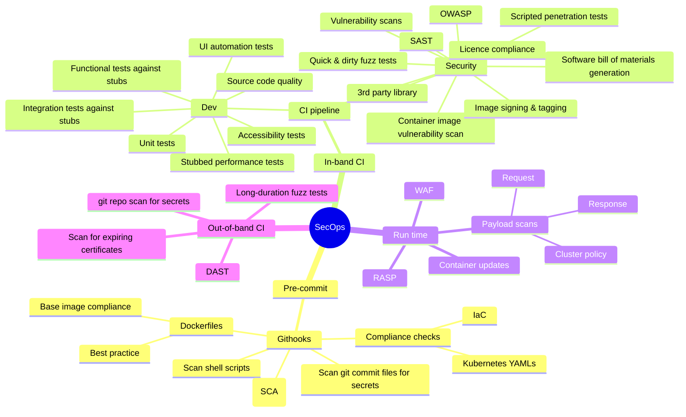

# devsecops-considerations
Things to consider when implementing DevSecOps

# Pretext

Getting up to speed with a reliable, auditable, repeatable DevSecOps process is a significant challenge for most organisations. This document attempts to distill my learnings over the past 10+ years of working in the DevSecOps space

# CI/CD platform

There's a massive amount of information out there about different CI/CD platforms. In my time as a consultant, I've worked with many of them, but most importantly I've had very little involvement with evaluating and selecting the CI/CD platform tooling used at an organisation.

I'm going to leave the selection of CI/CD platform tooling to other resources, and instead focus on what should run inside that platform.

# Overview

I'm going to break down DevSecOps into 4 distinct phases as follows

